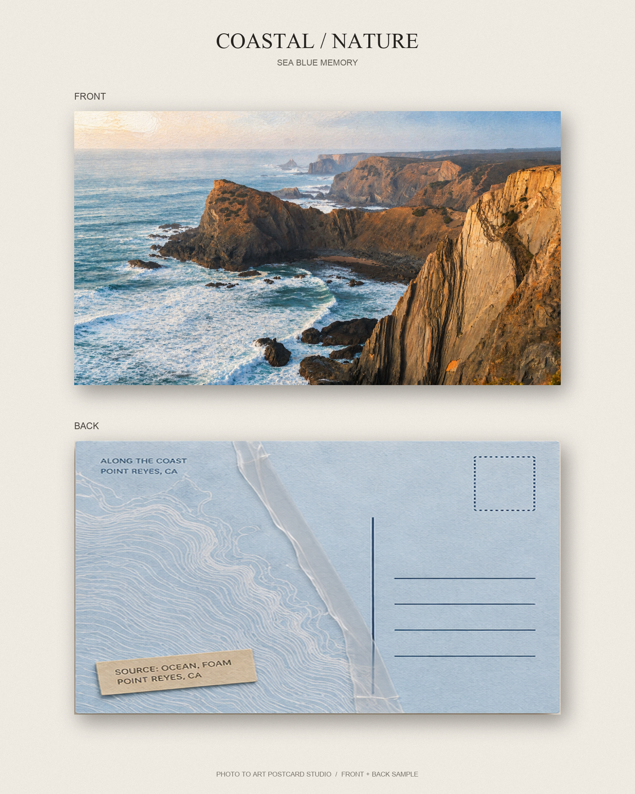
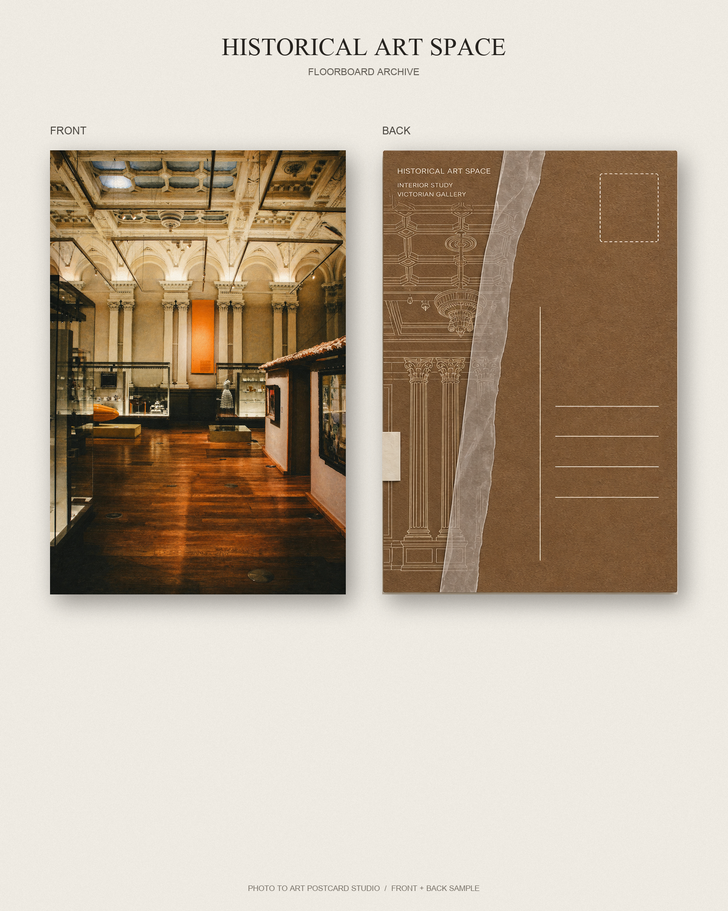
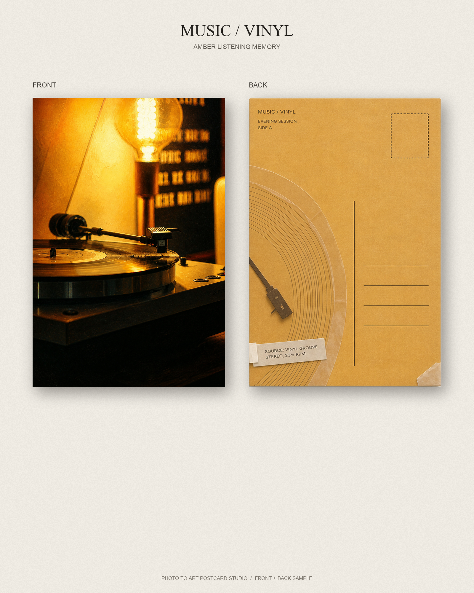
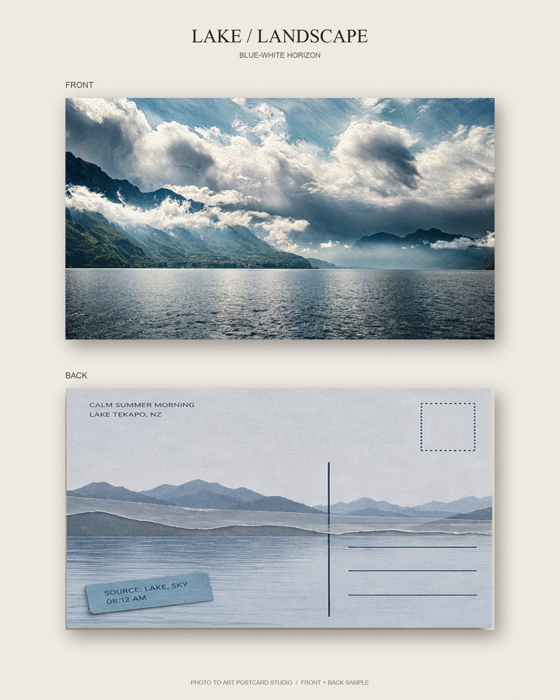
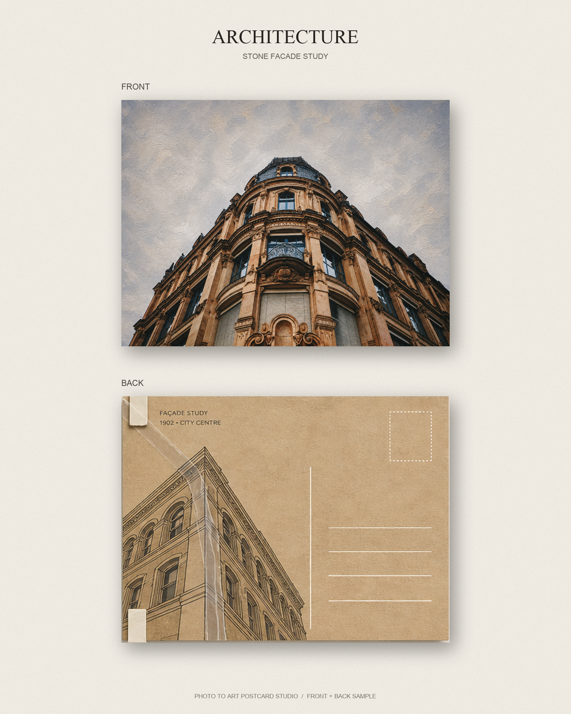
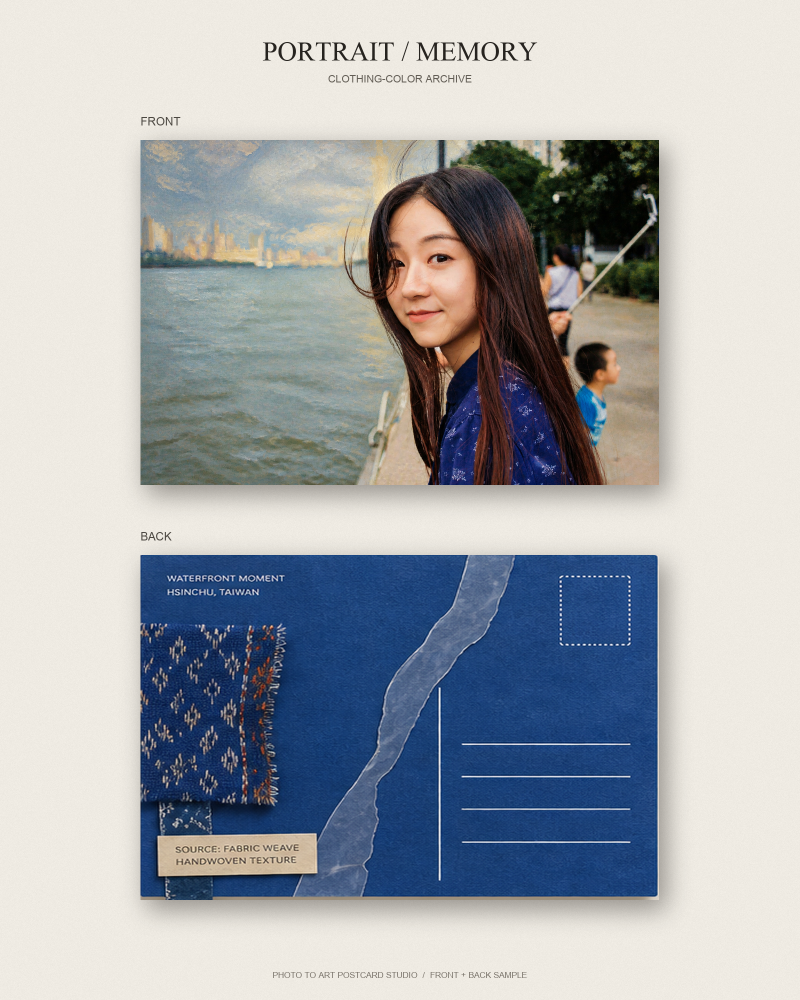

# Photo To Art Postcard Studio

Turn a personal photograph into a collectible art postcard with a designed front, a functional back, and a source-aware material system.

The project is currently an experimental Codex Skill. Photography stays recognizable while composition, color, texture, postcard structure, image abstraction, and tape/material decisions are selected from the source rather than imposed as one fixed template.

## Samples

| Coastal | Historical art space |
|---|---|
|  |  |

| Music / vinyl | Lake |
|---|---|
|  |  |

| Architecture | Portrait |
|---|---|
|  |  |

## Confirmed directions

- Photo + Oil Fusion
- Artist Travel Archive
- Museum Art Collection

## Current signature

- source photograph remains identifiable;
- horizontal or vertical orientation follows the protected subject;
- every postcard includes a matching back unless a front-only study is requested;
- the back selects a source-derived hero color instead of defaulting to pale beige;
- image echoes are abstracted from meaningful source elements rather than repeated thumbnails;
- tape and banded materials are optional and must attach, connect, bridge, mask, or extend something specific;
- one piece or a purposeful multi-piece ensemble may be used, with different roles for every piece.

## Skill structure

- `SKILL.md` — workflow, authorization boundaries, and mandatory rules
- `references/` — artistic directions, composition, crop/frame, postcard backs, material/tape, production, and QA
- `samples/social/` — six front/back presentation samples
- `scripts/` — local sample and package helpers

## Status

Visual direction is validated. Physical paper, printing, emboss/deboss, raised varnish, and packaging specifications are still in prototype testing and should not be treated as final manufacturing specifications.

## License

- Skill instructions, references, and scripts: [PolyForm Noncommercial License 1.0.0](LICENSE.md)
- Original example and visual assets: [CC BY-NC-SA 4.0](ASSETS_LICENSE.md), except third-party source material
- Commercial use: [separate permission is required](COMMERCIAL_USE.md)
- Project name and identity: see [PROJECT_IDENTITY.md](PROJECT_IDENTITY.md)
